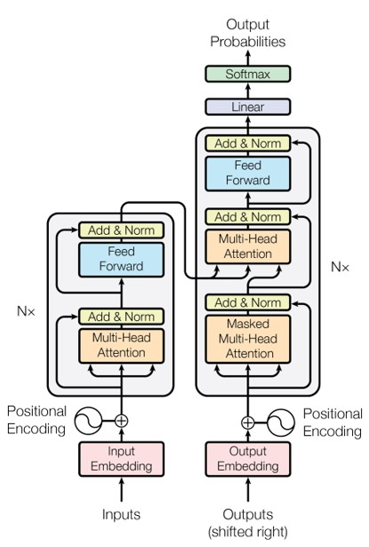
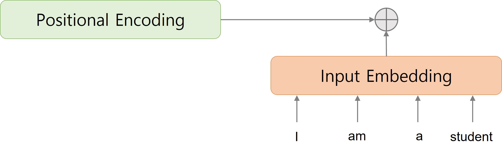
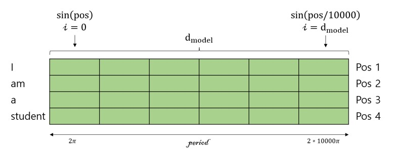
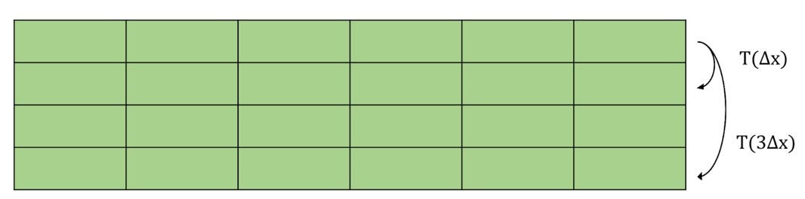
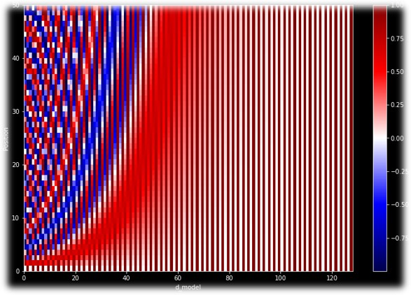

Summary of Transformer paper(Attention is all you need)  

<!--more-->

#### Introduction

Transformer은 2017년 NIPS에 게재된 논문으로, RNN기반 모델이 SOTA를 이루던 기존 NLP에 새롭게 SOTA를 달성한 모델입니다. 최근 NLP분야에서 좋은 성능을 내는 모델들은 transformer를 기반으로 한 모델들이 많습니다. 대표적으로는 2018년 google에서 공개한 BERT와 2020년 OpenAI에서 공개한 GPT-3가 있습니다.  

<em>Fig n.</em>

기존 NLP분야에서 많이 쓰이던 RNN을 이용한 방식에는 한계점이 있었습니다.  
우선 Seq-to-Seq의 경우 vanishing gradient와 fixed-size context vector의 문제가 나타납니다. RNN 방식을 사용하기 때문에 squence의 길이가 길어지면, gradient가 소실되어 훈련이 잘 안되는 문제가 있습니다. 예를 들어, "I am a good student"라는 문장에서 student라는 단어를 비워놓고 예측한다고 가정할 때, "I"에 관한 정보는 "good"에 비해 student에서 멀리 떨어져 있기 때문에 관계를 학습하기 더 힘듭니다.  
이에 decoder에서 매번 encoder를 참조(가중치 계산)하여 결과를 예측하는 attention 방식이 등장하였습니다. 모든 decoder step에서 encoder를 참조하기 때문에 앞서 말한 문제점은 완화되지만, 여전히 RNN 방식을 사용한다는 한계점이 존재했습니다. Time step으로 인해 병렬처리에 한계가 있기 때문에 연산 속도가 느린 단점이 남아있고, 또한 encoder에서 decoder로 context를 전달하는 context vector의 크기가 정해져 있기 때문에 정보의 손실이 일어날 수 있는 문제점이 있습니다.  
따라서 기존 RNN 방식이 아닌 새로운 architecture, transformer가 등장했습니다. Transformer는 attention을 Seq-to-Seq에서와 같이 추가 구조로써 사용하는 것이 아니라 attention을 중심으로 model architecture를 구성했습니다. 

#### Attention

Attention은 decoder에서 예측할 output과 encoder의 sequence들과의 관계가 어느정도 있는지 판단하여 output을 예측하기 위한 방법입니다. 앞서 예를 들었던 "I am a good student"의 경우 'am'보다 'I'가 'student'라는 단어를 예측하는 것에 더욱 연관성이 있기 때문에 'I'라는 단어에 더욱 집중(attention)하여 'student'를 예측하는 것에 사용합니다. 이에 관한 내용은 아래의 그림에 나타나 있습니다.  

Attention은 기본적으로 Query, Key, Value를 사용하여 attention value를 구합니다.  

-   Query: t시점에서의 decoder의 hidden state  
-   Key: 모든 시점의 encoder의 hidden state  
-   Value: 모든 시점의 encoder의 hidden state  

Attention의 machanism 중 하나인 dot-product machanism의 경우, Query와 Key에 dot-product를 취합니다(Attention Score). Attention score에 softmax를 적용하여 score의 합이 1이 되도록 해줍니다(Attention Weight). Attention weight는 각 encoder의 step이 decoder의 hidden state와 얼마나 연관성이 있는지를 나타냅니다. Attention value는 attention weight에 Key를 weight sum을 적용하여 구합니다. 가중치가 높은 step의 hidden state일수록 attention value에 기여하는 바가 높고, attention value는 decoder의 hidden state에 concatenate되어 사용되기 때문에 해당 step에 더 집중하여 output을 얻을 수 있습니다.  
Attention의 전체적인 진행 과정은 Fig. 와 같습니다. 

Translation을 수행할 때 계산된 두 언어 사이의 attention score를 나타내면 다음과 같습니다. Translate과정에서 연관된 단어들 사이의 attention이 높은 것을 확인할 수 있고, attention이 training에서 제대로 동작하고 있다는 것을 알 수 있습니다. 

<em>Fig n.</em>

##### Self-Attention

Transformer에서는 self-attention이라는 method가 사용됩니다. Attention과 전체적인 진행 과정은 동일하지만 self-attention은 query, key, value가 모두 encoder의 hidden state라는 점이 다릅니다. Attention은 예측할 decoder의 output과 encoder input의 관계(변역이라면 언어 사이의 관계, 빈칸 예측이라면 단어 사이의 관계)를 얻기 위해 수행하지만, self-attention은 input으로 들어가는 sequence의 이해를 위해서 사용이 됩니다.  

### Transformer

Transformer(Attention is all you need)는 제목 그대로 RNN이 아닌 attention machanism만 사용하여 architecture를 구성합니다. Architecture는 크게  

-   Positional Encoding  
-   Encoder  
-   Decoder  
    의 범주로 나눌 수 있습니다.  
    

    

    
<em>Fig n.</em>

    

##### Positional Encoding

자연어 처리에서 단어를 vectorization할 때 embedding을 진행하게 됩니다. One-hot vector의 형식으로 corpus의 단어들을 모두 표현하려면 vector의 공간이 너무 커지게 됩니다. (10만개의 단어가 있다면, dimension 또한 10만) 따라서 corpus의 크기에 상관없이 일정한 차원의 벡터에 단어값을 설정하여 dense representation으로 만들어주는 것을 embedding이라고 합니다. 기존의 RNN에선 훈련에 사용될 vector는 embedding만 사용했지만 transformer에서는 positional encoding(이하 PE)이라는 추가적인 작업이 필요합니다.  

PE은 단어의 위치 정보를 model에 알리는 방식입니다. 단어의 위치를 알 수 없다면 문장의 의미가 완적히 달라질 수 있기 때문입니다. 예를 들어, "귤은 과일이다"와 "과일은 귤이다"의 의미는 완전히 다릅니다. RNN은 위치에 따라 입력된 단어를 순차적으로 받아 처리하기 때문에 각 단어가 위치 정보를 자동적으로 모델이 학습하기 때문에 자연어 처리에서 강력합니다.(Sequentiality inductive bias가 있다고 말합니다.) 그러나 Transformer는 입력된 단어를 순차적으로 받지 않기 때문에 다른 방식(PE)으로 위치 정보를 알립니다. 그림 n과 같이 PE는 일부 값을 입력 임베딩 매트릭스와 합산하여 수행됩니다.  

 

<em>Fig n.</em>

PE를 구현하기 위해서 다음과 같은 조건은 지켜져야 합니다.  

1. 각 position 별로 vector값이 다 달라야한다.  
2. 문장의 길이가 다르더라도 적용할 수 있는 method여야 한다.  
3. 문장의 길이가 달라도각 position 사이의 길이가 일정해야한다.  
    - 예를 들어, 단어가 5개인 문장의 포지션 간의 간격이 5라면, 단어가 20개인 문장의 포지션 간의 간격도 5여야한다.  
    - 즉, 다음 단어로 이동할 때 거리가 일정한 method여야 한다.
4. 모델의 일반화가 가능해야한다.  
    - 단어가 10개인 문장이 나와도, 1000개인 문장이 나와도 적용될 수 있어야한다.  
    - 예를 들어, position 값이 일정 범위 이내에 있어야 한다.  
    - transformer에서는 PE값을 입력에 더해주기 때문에 너무 큰 값이 들어가면 안됨  
5. 같은 문장이라면 매번 같은 값이 나와야한다. 

Transformer에서는 sin, cos 함수를 사용하여 PE를 구현합니다.  

<em>Fig n.</em>

기본적으로 PE는 embedding된 input과 더해져야하기 떄문에 사이즈가 같습니다. 따라서 (sequence length, embedding dimension(=$d_{model}$))차원의 matrix가 됩니다. 행은 sequence에서 단어의 위치를 나타내고, 열은 position vector의 index를 의미합니다. PE의 각 elements는  

$$
\begin{align}
\sin(\pi i/2^{j}) \rightarrow \sin(x_{i}w_{0}^{j/d_{model}}),\;\;i=0 \sim d_{model}-1,\;\;j=0\sim seq_{len}-1 \\
\mathbb{PE} = [v^{(0)},\ldots,v^{seq_{len}-1}]^{T},\quad v^{(i)}=[\cos(w_{0}x_{i}),\; \sin(w_{0}x_{i}),\; \ldots,\; \cos(w_{n-1}x_{i}),\; \sin(w_{n-1}x_{i}) ] \\
\end{align}
$$

로 나타납니다.   
삼각함수를 사용했기 때문에 기본적으로 값의 범위가 -1 ~ 1로 제한되어 있고, 주기함수이기 때문에 sequence의 길이가 달라져도 적용할 수 있습니다. 또한 같은 position에서는 같은 value가 나오기 때문에 1,2,4,5 조건을 다 만족할 수 있습니다. 조건 3을 만족시키기 위해서 $PR(x + \Delta x)=PE(x) \cdot T(\Delta x)$ 를 만족해야하는데 이는 회전 변환으로 만족시킬 수 있습니다.  

<em>Fig n.</em>

PE가 기본적으로 cos, sin의 조합으로 이루어져 있기 때문에 T를 회전변환 블록으로 나타낼 수 있습니다. 회전변환 블록은  

$$
\begin{align}
    \begin{pmatrix} \cos (w_0 + \Delta x) \\ \sin (w_0 + \Delta x) \end{pmatrix}
    = \begin{pmatrix} \cos \Delta x & -\sin \Delta x \\ \sin \Delta x & \cos \Delta x \end{pmatrix}
    \begin{pmatrix} \cos w_0  \\ \sin w_0 \end{pmatrix}
\end{align}
$$

와 같이 나타낼 수 있고, 전체 회전변환 $T$는  

$$
\begin{align}
    T(\Delta x) =
    \begin{bmatrix}
        \begin{pmatrix} \cos (w_0 \Delta x) & -\sin (w_0 \Delta x) \\ \sin (w_0 \Delta x) & \cos (w_0 \Delta x) \end{pmatrix} & \cdots & 0 \\
        \vdots & \ddots & \vdots \\
        0 & \cdots & \begin{pmatrix} \cos (w_{n-1} \Delta x) & -\sin (w_{n-1} \Delta x) \\ \sin (w_{n-1} \Delta x) & \cos (w_{n-1} \Delta x) \end{pmatrix}
    \end{bmatrix}
\end{align}
$$

로 표현할 수 있습니다. 따라서 각 position 사이의 간격이 동일하다고 말할 수 있으며 PE의 모든 조건을 만족할 수 있습니다. 
Sequence length가 50, $d_{model}$이 128인 Positional Encoding을 나타내면 Fig n.과 같습니다.  

<em>Fig n.</em>

### Reference  
