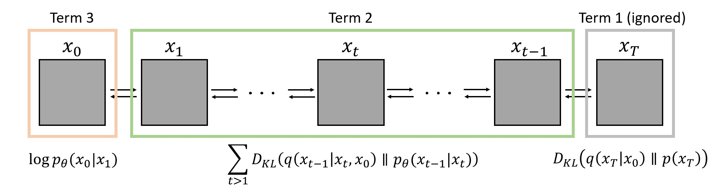

DDPM은 2020년 NeurIPS에 게재된 논문으로, Diffusion Model(DM)을 기반으로 한 generative model입니다. 
Sampling에 반대되는 방향으로 DM(Gaussian noise를 추가하는 것을 data가 파괴(noise)가 될 때까지 하는 Markov chain)의 reverse를 학습하는 diffusion model입니다.  

---

<!--more-->

#### Introduction

Generative 분야에는 GAN, VAE 등이 있고, 최근에는 energy-based model과 score mathing model도 GAN과 비교될만큼 큰 발전을 이루었습니다.  
논문에서는 finite time 이후와 맞는 sample을 생성시키기 위해 variational inference를 사용해서 Markov chain을 훈련시킨 Diffusion Model(이하 DM)을 제안합니다.  

-  Markov Chain: 미래의 조건부 확률 분포가 과거에 독립적이고 현재에만 의존한다는 Markov property를 따르는 discrete time stochastic process  
-  VI(Variational Inference): $$p(x \mid z) = \frac{p(z \mid x)p(z)}{p(x)}$$에서 posterior를 찾기 힘들 때, 더 쉬운 확률 분포 $$q(z)$$로 근사하기 위한 방법  

DM은 input으로 들어온 이미지를 이미지가 파괴(noise)가 될 때까지 noise를 추가하는 difussion process(forward process)의 반대방향을 학습하도록 구성됩니다. Diffusion process에서 각 time step에서 더해지는 noise의 variance가 충분히 작다면, 이 과정은 Neural Network(이하 NN)로 parameterize할 수 있습니다. Diffusion이 진행될수록 distinguish한 특성은 사라지고 isotropic gaussian distribution으로 변합니다. 즉, 마지막 step에서 이미지는 $$\mathcal{N}(0, I)$$를 따르게 됩니다.  

<em>Fig n.</em>

#### Background

DM은 $$p_{\theta}(x_{0}) := \int p_{\theta}(x_{0:T})dx_{1:T}$$의 형태로, $$x_{1},\ldots, x_{T} \sim q(x_{0})$$인 모든 latent가 $x_{0}$와 같은 dimension을 가지고 있는 latent variable model입니다. Image에 gaussian noise를 더해가며 diffusion process가 진행되지만, 이 과정에서 latent의 dimension은 변하지 않습니다.  
$x_{0}$로부터 $x_{T}$(destroyed image)까지의 diffusion process인 forward process는 다음과 같이 표현됩니다.  

$$
\begin{align}
q(x_{1:T} \mid x_{0}) := \prod_{t=1}^T q(x_{t} \mid x_{t-1}), \quad q(x_{t} \mid x_{t-1}) := \mathcal{N}(x_{t}; \sqrt{1-\beta_{t}}x_{t-1, \beta_{t}I}) \\
\end{align}
$$

Forward process에서 $$\beta$$는 learnable하게 설정할 수도 있고, constant variable로 설정할 수도 있습니다.  
또한 forward process에서 임의의 timestep $$t$$에서의 sampling $$x_{t}$$를 $$x_{0}$$에 대한 closed form으로 나타낼 수 있습니다. $$\alpha_{t} := 1 - \beta_{t}, \;\; \bar{\alpha}_{t}:=\prod_{s=1}^{t}\alpha_{s}$$라고 하면 아래와 같이 나타낼 수 있습니다.  

$$
\begin{align}
q(x_{t} \mid x_{0}) = \mathcal{N}(x_{t};\sqrt{\bar{\alpha}_{t}}x_{0},(1-\bar{\alpha}_{t})I)
\end{align}
$$

  

    details
  
  
  

    식 (1)에 의해  
    \begin{align}
    q(x_{t} \mid x_{0}) = q(x_{t} \mid x_{t-1})q(x_{t-1} \mid x_{t-2}) \cdots q(x_{2} \mid x_{1})q(x_{1} \mid x_{0}) \\
    \end{align}
    과 같이 표현될 수 있습니다. 
    <ul>
        <li>Mean </li>
            Mean의 경우 $$\mathbb{E}(aX) = a\mathbb{X}$$ property를 가지고 있기 때문에  
            \begin{align}
            \prod_{s=1}^{t} \sqrt{1-\beta_{t}} = \prod_{s=1}^{t} \sqrt{\alpha_{t}} = \sqrt{\bar{\alpha}_{t}} \\
            \end{align}
        <li>Variance </li>
            Variance도 마찬가지로 $$a\Var(X) = \Var(a^{2}X)$$ property를 가지고 있지만 $$x_{t} = \sqrt{1-\beta_{t}}x_{t-1} + \beta_{t}z, z \sim \mathcal{N}(0,I)$$와 같이 더해지는 형식이기 때문에 mean과 다르게 계산됩니다.  
            $$t=4$$일 때를 예로 들어보면,  
            \begin{align}
            q(x_{4} \mid x_{0}) &= \sqrt{\alpha_{4}}(\sqrt{\alpha_{3}}(\sqrt{\alpha_{2}}(\sqrt{\alpha_{1}}x_{0}+\beta_{1}z)+\beta_{2}z)+\beta_{3}z)+\beta_{4}z \\
            &= \sqrt{\bar{\alpha_{4}}}x_{0}-(\alpha_{4}\alpha_{3}\alpha_{2}(\alpha_{1}-1)+\alpha_{4}\alpha_{3}(\alpha_{2}-1)+\alpha_{4}(\alpha_{3}-1)+(\alpha_{4}-1)) \\
            &= \sqrt{\bar{\alpha_{4}}}x_{0} - (\alpha_{4}\alpha_{3}\alpha_{2}\alpha_{1} - \alpha_{4}\alpha_{3}\alpha_{2} + \alpha_{4}\alpha_{3}\alpha_{2} - \alpha_{4}\alpha_{3} + \alpha_{4}\alpha_{3} - \alpha_{4} + \alpha_{4} -1) \\
            &= \sqrt{\bar{\alpha_{4}}}x_{0} + 1 - \alpha_{4}\alpha_{3}\alpha_{2}\alpha_{1} \\
            &= \sqrt{\bar{\alpha_{4}}}x_{0} + 1 - \bar{\alpha}_{4} \\
            \end{align}
            따라서, 마찬가지로 step $$t$$에서 Variance: $$1-\bar{\alpha}_{4}$$
    </ul>
  

Diffusion에서 $$\beta$$의 크기가 충분히 작다면 reverse process 또한 gaussian diffusion이라고 간주할 수 있습니다.   
$x_{T}$로부터 $x_{0}$(generate image)까지의 process인 reverse process는 다음과 같이 표현됩니다.  

$$
\begin{align}
p_{\theta}(x_{0:T}) := p(x_{T})\prod_{t=1}^T r_{\theta}(x_{t-1} \mid x_{t}), \quad p_{\theta}(x_{t-1} \mid x_{t}) := \mathcal{N}(x_{t-1}; \mu_{\theta}(x_{t},t),\mathsf{\Sigma}_{\theta}(x_{t},t)) \\
\end{align}
$$

DM은 posterior인 $$q(x_{1:T} \mid x_{0})$$을 inference 하도록 학습됩니다. Training은 NLL에 대한 variational bound를 optimize함으로써 수행됩니다.  

$$
\begin{align}   
\mathbb{E}[-\log p_{\theta}(x_{0})] &\le D_{KL}(q \parallel p) :=\mathcal{L}\\
&= \mathbb{E}_{q}[\log \frac{q(x_{1:T} \mid x_{0})}{p_{\theta}(x_{0:T})}] = \mathbb{E}_{q}[-\log \frac{p_{\theta}(x_{0:T})}{q(x_{1:T} \mid x_{0})}] \\
&= \mathbb{E}_{q}[-\log p(x_{T})-\sum_{t \ge 1}\log \frac{p_{\theta}(x_{t-1} \mid x_{t})}{q(x_{t} \mid x_{t-1})}] \\
&= \mathbb{E}_{q}[-\log p(x_{T})-\sum_{t > 1}\log \frac{p_{\theta}(x_{t-1} \mid x_{t})}{q(x_{t} \mid x_{t-1})}-\log\frac{p_{\theta}(x_{0} \mid x_{1})}{q(x_{1} \mid x_{0})}] \\
&= \mathbb{E}_{q}[-\log p(x_{T})-\sum_{t > 1}\log \frac{p_{\theta}(x_{t-1} \mid x_{t})}{q(x_{t-1} \mid x_{t},x_{0})}\cdot \frac{q(x_{t-1} \mid x_{0})}{q(x_{t} \mid x_{t})}-\log\frac{p_{\theta}(x_{0} \mid x_{1})}{q(x_{1} \mid x_{0})}] \\
&= \mathbb{E}_{q}[-\log\frac{p(x_{T})}{q(x_{T} \mid x_{0})}-\sum_{t > 1}\log \frac{p_{\theta}(x_{t-1} \mid x_{t})}{q(x_{t-1} \mid x_{t},x_{0})}-\log p_{\theta}(x_{0} \mid x_{1})] \\
&= \mathbb{E}_{q}[D_{KL}(q(x_{T}\mid x_{0}) \parallel p(x_{T}))+\sum_{t >1}D_{KL}(q(x_{t-1}\mid x_{t},x_{0}) \parallel p_{\theta}(x_{t-1}\mid x_{t}))-\log p_{\theta}(x_{0} \mid x_{1})] \\
\end{align}
$$

첫번째 term($$\mathcal{L}_{T}$$)은 $$x_{T}$$에 대한 term으로, variance가 constant로 설정되어 있고, T step에서는 완전히 destroyed되어 $$x_{T} \sim \mathcal{N}(0,I)$$를 따르기 때문에 무시됩니다.   
두번째 term($$\mathcal{L}_{t}$$)은 $$t: 1 \sim t-1$$에서의 이상적인 posterior $$q$$로 trainable한 $$p_{\theta}$$를 approximation하기 위해 KL divergence를 최소화하기 위한 term입니다.  
세번째 term($$\mathcal{L}_{0}$$)은 $$t: 1 \sim t-1$$에서와 다르게 실제 input image인 $$x_{0}$$와 비교하기 위해서는 실제 이미지와 같이 8bit로 값들을 quantization해줘야하기 때문에 이에 대한 term은 따로 분리해줬습니다.  

<em>Fig n.</em>

$$\mathcal{L}_{t}$$에서 $$p_{\theta}(x_{t-1}\mid x_{t})$$는 forward process의 $$x_{0}$$에서 tractable한 posterior와 KL divergence를 계산합니다.  

$$
\begin{align}  
q(x_{t-1}\mid x_{t},x_{0}) = \mathcal{N}(x_{t-1};\tilde{\mu}_{t}(x_{t},x_{0}), \tilde{\beta}_{t}I) \\
\tilde{\mu}_{t}(x_{t},x_{0}) := \frac{\sqrt{\bar{\alpha}_{t-1}}\beta_{t}}{1-\bar{\alpha}_{t}}x_{0} + \frac{\sqrt{\alpha_{t}}(1-\bar{\alpha}_{t-1})}{1-\bar{\alpha}_{t}}x_{t}, \quad \tilde{\beta}_{t} := \frac{1-\bar{\alpha}_{t-1}}{1-\bar{\alpha}_{t}}\beta_{t} \\ 
\end{align}
$$

$$\mathcal{L}$$의 모든 KL divergence는 gaussian 간이기 때문에 Monte carlo estimate 대신 Rao-Blackwellized 방식으로 계산할 수 있습니다. (Appendix)

#### Diffusion models and denoising autoencoders

#### Appendix

---

-   [DDPM ppt](https://github.com/Nakkwan/Nakkwan.github.io/blob/main/pdf/DDPM.pdf) 

---

##### Reference  

-   [Langevin Dynamics](https://towardsdatascience.com/langevin-dynamics-29bbb9407b47) 
-   [DDPM Blog](https://lilianweng.github.io/lil-log/2021/07/11/diffusion-models.html) 
-   [DDPM paper](https://arxiv.org/abs/2006.11239) 
-   [Nonequilibrium Thermodynamics](https://arxiv.org/abs/1503.03585) 
